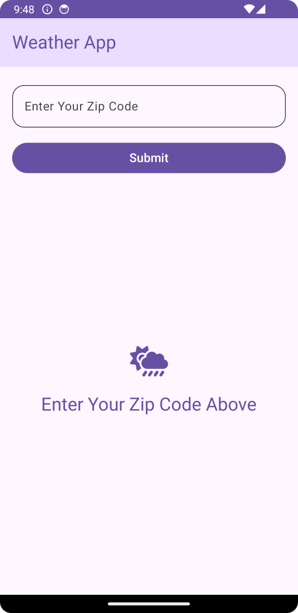
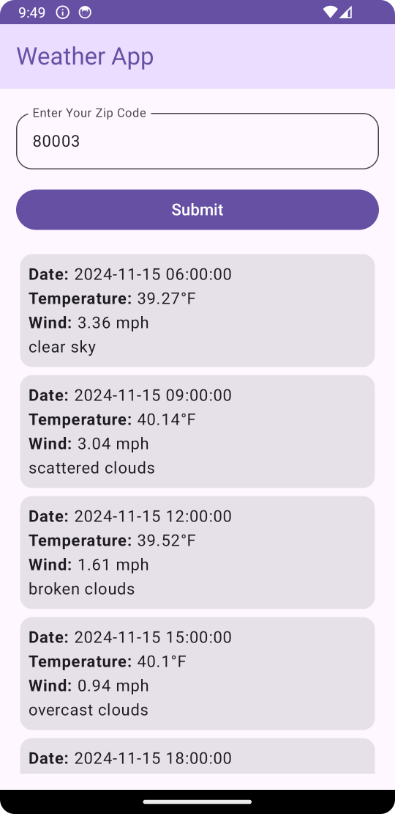
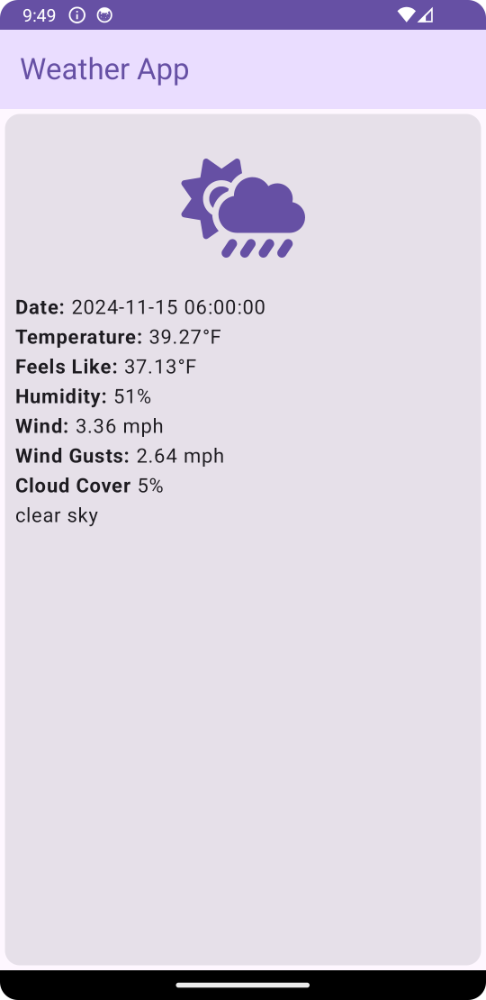

# WeatherApp
* This is a simple weather application leveraging Jetpack components.
* It uses the [openWeather](https://openweathermap.org) API.
* The app prompts the user to enter a Zip code and on clicking submit or done, converts the zip to lat/long and uses that to get the the weather forecast for that location for the next five days.

## Missing Requirements
- Use [Room](https://developer.android.com/jetpack/androidx/releases/room) in the repo layer to provide caching for the last fetched weather data set, and the associated zip code.
- Add unit tests.

## TODO/Notes/Features:
- In the retrofit services: add the app_id in a more centralized way, maybe using an interceptor.
- Add an app setting for units of measure.
- Get the user's language from the system and send it on the api requests.
- Add country code to the zip code input (and send it to the api). The current implementation is hoping the api can figure out what country the zip is associated with.
- Add a weather api key user setting.
- Use the api to get [weather icons](https://openweathermap.org/weather-conditions) and show them in the list and detail views using the [Coil](https://github.com/coil-kt/coil#jetpack-compose) library.
- Better validation & sanitizing of user input. - Disable submit and display instructions until the input is 5 numbers (or match it to zip requirements per country).
- Turn the dates into date objects and do nicer displays of date.
- More appropriate/consistent use of the theme so light/dark modes work well.

## Screenshots

